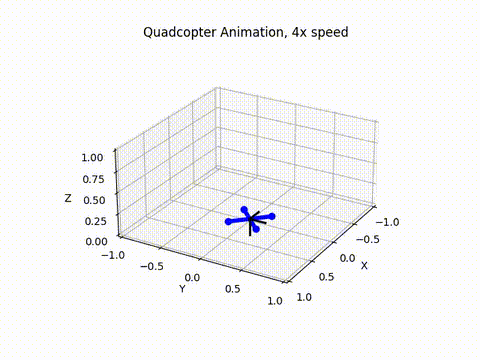

# DeePC Quadcopter
This project investigates the use of regularized Data-Enabled Predictive Control (DeePC) for controlling a quadcopter.

DeePC is a data-driven control method, originally formulated by Coulson, Lygeros, and Dörfler in [1]. Although the presented theory requires the system to be linear, the authors also propose a regularized version to better handle potential nonlinearities and measurement noise. Building on this extension, Elokda, Coulson, Beuchat, Lygeros, and Dörfler apply the method on a quadcopter, offering valuable insights into the selection of hyperparameters [2].

This project aims to provide additional insights into the application of DeePC to quadcopters and further validate the approach.



The flight is divided into two parts:
  - **Data collection** - A standard LQR controller with added white noise excites the system.
  - **Reference tracking** – Given persistently exciting input data, the DeePC algorithm controls the system to follow a desired reference trajectory.

## Usage
1. Clone the repository and install the dependencies found in **requirements.txt**.
  
2. In the **main.py** file:
    - This file is from where the code is ran. Here it is possible to simulate, save and animate the flightdata.
    - Trajectory can be changed by varying the "sort" attribute of TrajectoryGenerator class. See **trajectory_generator.py** to change specific trajectory parameters and get insights in how to define your own trajectory method.
    - The initial controller can be modified, see **Controllers/lqr.py** to see how the LQR controller is defined.
    - Other parameters such as sampling time and reference duration can also be chosen.

3. Other files and their purposes:
    - **Controllers/deepc.py** - Contains DeePC class using CVXPY optimization library. Here every parameter to do with the DeePC approach can be tuned.
    - **Movies** - Folder where the animations are saved.
    - **Results** - Folder where the flight data from a run is saved in hdf5 format.
    - **Plots** - Folder where plots of the simulated flight data is saved.
    - **Simulator/simulation.py** - Contains general simulator class using RK4 integration.
    - **hdf5_reader.py** - Contains HDF5Reader class where data can be saved to and read in hdf5 format.
    - **quadcopter.py** - Contains quadcopter class where quadcopter dynamics, physical parameters, constraints, DeePC cost matrices and rotation matrices are defined.
    - **visualization.py** - Contains animator class using FunAnimation from matploblib.animation.
  
### Example run
Without changing anything from this repository:

Run **main.py**

Terminal output:
```
Animate result, simulate or exit (a/s/e): s
Simulating...
Time: 0.00s, Input: [0.54967142 0.48617357 0.56476885 0.65230299], Output: [0. 0. 0. 0. 0. 0.]
Time: 0.10s, Input: [0.41853774 0.52153723 0.57736386 0.37286703], Output: [ 0.02184803 -0.02621927 -0.00065247  0.00024173  0.00020131 -0.00620696]
Time: 0.20s, Input: [0.51148369 0.57598    0.2425629  0.34536114], Output: [ 0.0213002  -0.08000499  0.00299955  0.00324245  0.00235798 -0.01585102]
...
Time: 63.80s, Input: [0.43315397 0.48376853 0.54078131 0.48924917], Output: [ 0.0333928   0.19800212  0.10928393  0.93593505  0.21744715 -1.00964611]
Time: 63.90s, Input: [0.44345329 0.50050055 0.54307275 0.48914206], Output: [ 0.09414338  0.17734852  0.11917719  0.96656458  0.1788025  -1.0080222 ]
Would you like to save the result? (y/n): y
Enter additional information to save with the result: example
Animate result, simulate or exit (a/s/e): a
-------------------------------------
1: deepc_quadcopter_box_.hdf5
2: deepc_quadcopter_step_.hdf5
3: deepc_quadcopter_figure8_.hdf5
4: deepc_quadcopter_figure8_example.hdf5
Enter the number of the file you want to choose: 4
-------------------------------------
Animating quadcopter flight...
Animation saved as deepc_quadcopter_figure8_example.mp4 in DeePC_Quadcopter/Movies
Animate result, simulate or exit (a/s/e): e
```
## Key insights
[2] utilizes an inner control loop to regulate the yaw of the quadcopter, effectively keeping it "straight." This allows the linearized dynamics to approximate the real system well for small orientation angles, enabling DeePC to focus on controlling the position of the quadcopter without needing to learn the influence of the motors on yaw orientation. In contrast, this work includes both the quadcopter’s orientation (Φ, Θ, Ψ) and position (X, Y, Z) as outputs since no inner controller is used. As a result, DeePC is also responsible for regulating the yaw in this setup. If yaw is not explicitly regulated, the quadcopter tends to drift, causing the body frame to gradually misalign with the inertial frame. Once this deviation becomes too large, the system becomes unstable as DeePC relies on data that is closely aligned with the inertial frame. Alternative adaptive DeePC techniques could be explored to address the issues of the drift, but that lies outside the scope of this project.

The following points are key to achieving satisfactory results:
  - It is important to penalize **u - u<sub>r</sub>** in the cost function, rather than just **u**, where **u<sub>r</sub>** is the steady-state control input.
  - **T<sub>ini</sub>** should be chosen as small as possible without compromising performance.
  - Regularization is essential for handling nonlinear dynamics.
  - Using the **L2** norm for regularization performed better than **L1** in this case.
  - Penalizing **g - g<sub>r</sub>** as regularization helps improve performance, where **g<sub>r</sub>** is the steady-state solution of the DeePC constraint, see [2].
  - Having a taskspecific initial trajectory to help excite the system.

## References

[1] Coulson, J., Lygeros, J., & Dörfler, F. (2019). *Data-enabled predictive control: In the shallows of the DeePC*. https://arxiv.org/abs/1811.05890

[2] Elokda, E., Coulson, J., Beuchat, P., Lygeros, J., & Dörfler, F. (2021). *Data-enabled predictive control for quadcopters*. https://www.researchgate.net/publication/353220500_Data-enabled_predictive_control_for_quadcopters
